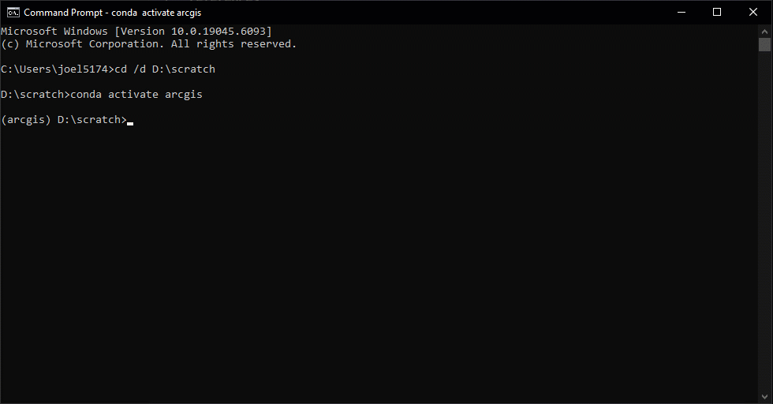

# Cookiecutter-Spatial-Data-Science 3.4.1-dev0

Creating results effectively communicating actionable insights from data requires
creative exploration and experimentation. It is a sloppy, messy and disorganized
process, especially at first. Reproducing results, by you or by others, requires 
well organized and documented resources. Data analysis, data science or data 
engineering projects require both creative exploration and reproducability.

Trying to create structure inhibits creativity. Disorganization inhibits 
reproducability. Cookiecutter-Spatial-Data-Science is a templated structure making
it possible to quickly get started and enable the creative exploration necessary
for discovering insights from data. Once discovered, within the structure
of the project, you can reproduce documented results with minimal effort.

This is accomplished by borrowing best practices from data science, and marrying these
with the capabilities of ArcGIS Pro. This enables taking advantage of the 
geographic (spatial) analysis and visualization capablities of ArcGIS Pro
in a structured way to derive reproducable and documented insights from data.

## Getting Started



Setup and basic use are well detailed with easily copyable commands in the 
[Getting Started](getting_started.md#setup-with-arcgis-pro) page.

## Origins

The Cookiecutter Spatial Data Science template arose out of a need for an experienced
geographer well versed in ArcGIS Pro and Python ([myself]) and a _very_ experienced data 
scientist new to Esri ([Daniel](https://www.linkedin.com/in/daniel-wilson-a274b218/)) 
to efficiently collaborate and hand off projects to other teams.

### Challenges

Every time we were working together on a project, we had to figure out how where to 
find the needed resources such as data, code, and required additional Python packages.
We also needed a way to provide some level of documentation for each project, so we
knew what to do when revisiting it a month later, and so we could hand off projects
to other teams.

The ad-hoc approach hampered efficiency at best. In reality, it was frustratingly
cumbersome to start working on a new project, and difficult to return to a previous
project, since each one was different. Handing projects off to new teams was nearly
impossible.

### Solution

This frustration led us to begin using the 
[Cookiecutter-Data-Science v1](https://cookiecutter-data-science.drivendata.org/) 
template created and maintained by [DrivenData Labs](https://drivendata.co/). We 
immediately appreciated the data science best practices baked into the tempalte, but 
quickly ran into some challenges when trying to marry ArcGIS Pro projects with
this new structure. 

Our evolution of this paradigm to integrate ArcGIS Pro projects
into the original template, add support for Windows environments, and use
Conda for Python environment management led to the Cookiecutter-Spatial-Data-Science
template. While not identical to the Cookiecutter-Data-Science template, our 
interpretation honors the best practices of the original 
[Opinions](https://cookiecutter-data-science.drivendata.org/opinions/).

### Evolution

Since building the initial Cookiecutter-Spatial-Data-Science template in early 2019,
Daniel has moved on from Esri to co-found [SeerAI](https://www.seer.ai). I moved from 
a Solution Engineer in Business Development (sales) to a Product Engineer in Development 
creating Data Engineering workflows.

For all of the subsequent years, I have continiously relied on this template for all my
work. With best practices all baked right in, I can quickly try ideas in ArcGIS Pro, 
iterate in Jupyter, migrate to a Python package, test and debug using PyTest, and have 
it all documented with minimal effort.

While I have made this template publicly available for a long time, and kept the template
current as my practices evolve, I am now attempting to provide more resources to make
this easier to discover, understand and use.

If you encounter an issue with this template, please feel free to log an issue in the
repo. If you know how to fix it, I welcome any help you are willing to lend. This project,
after all, is not my primary responsiblty. Rather, it is me sharing the tooling I have
developed over the years to make marrying ArcGIS Pro and Data Science a little easier.

## Project Structure

If creating a project named `sik-prj`, the structure of the project will look like the following.

```
├───.github
│   └───workflows
│           make-mkdocs.yml               # automatically build documentation using GitHub Actions with GitHub repo
├───arcgis                                # directory for ArcGIS Pro assets and resources
│   │   cookiecutter.tbx                  
│   │   README.md
│   │   sik-prj.aprx                      # ArcGIS Pro project
│   │   sik-prj.tbx                       # traditional toolbox used by ArcGIS Pro
│   │   sik_prj.pyt                       # ArcGIS Pro Python toolbox
│   ├───layer_files                       # location to save useful layer files
│   └───styles                            # collection of styles added to ArcGIS Pro project with more cartographic options
│           Firefly.stylx
│           GlassyNorthArrows.stylx
│           PaperCut.stylx
│           PenAndInk.stylx
│           PhysicalGeographyAtlas.stylx
│           Sketch.stylx
│           Watercolor.stylx
├───config                                # config files used with project
│       config.ini                        # config settings, which are NOT sensitive
│       secrets.ini                       # config settings, which ARE sensitive (usernames, passwords, etc.)
├───data                                  # location for data storage (excluded from version control)
│   ├───external                          # data used as part of data processing, but not data being transformed
│   │   └───external.gdb
│   ├───interim                           # intermediate location for caching data
│   │   └───interim.gdb
│   ├───processed                         # final output data location
│   │   └───processed.gdb
│   └───raw                               # raw immutable data location
│       └───raw.gdb
├───docsrc                                # MkDocs source directory
│   │   mkdocs.yml                        # MkDocs configuration file
│   │   requirements.txt                  # packages needed for building using MkDocs in GitHub
│   └───mkdocs                            # where markdown files and Jupyter Notebooks for docs are stored
│       │   api.md                        # example of documenting Python from DocStrings
│       │   index.md                      # example main documentation file
│       └───notebooks                     # location to store notebooks for inclusion in documentation
├───env                                   # directory created for Conda Python environment using make env command
├───models                                # location where machine learning models are saved (excluded from version control)
│   └───emd
│           example.emd
├───notebooks
│       notebook-template.ipynb           # Jupyter Notebook example with some useful boilerplate
├───references                            # location to save useful references used as part of project development
├───reports                               # location to save graphic outputs and logging outputs from analysis
│   ├───figures
│   └───logs
├───scripts                               # standalone automation scripts
│   │   config.ini                        # configuration options specific to standalone scripts
│   │   make_data.py                      # script used to run the data processing pipeline
│   │   make_pyt_archive.py               # supporting script helping to create standalone zipped archive of .pyt toolbox
│   └───raster_functions                  # location for ArcGIS Pro raster functions
├───src                                   # where Python source code lives
│   └───sik_prj                           # Python package for reusable code
│       │   __init__.py
│       │   __main__.py                   
│       │
│       └───utils
│               logging_utils.py
│               main.py
│               __init__.py
├───testing
│       test_sik_prj.py                   # example PyTest file
│
│   .bumpversion.cfg                      # configuration for Bumpversion 
│   .gitignore                            # files and directories to exclude from version control
│   environment.yml                       # additional packages to install in development environment
│   LICENSE                               # license file text
│   make.cmd                              # make commands for Windows
│   Makefile                              # make commands for *nix
│   pyproject.toml                        # Python package configuration (dependencies listed in here)
│   README.md                             # readme displayed on front page of GitHub repo
│   VERSION                               # project version number
```

## Debugging

Discovering issues when using this template is made easier with the by using this command.

```cmd
cookiecutter https://github.com/esri/cookiecutter-spatial-data-science --debug-file cookiecutter-debug.log --verbose
```

This outputs a log file named `cookiecutter-debug.log` in the current working directory, and provides a verbose output to the terminal. This information can be very useful when trying to diagnose issues.
